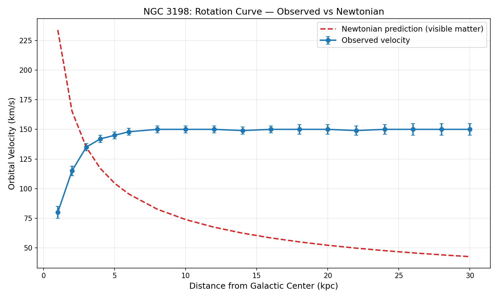
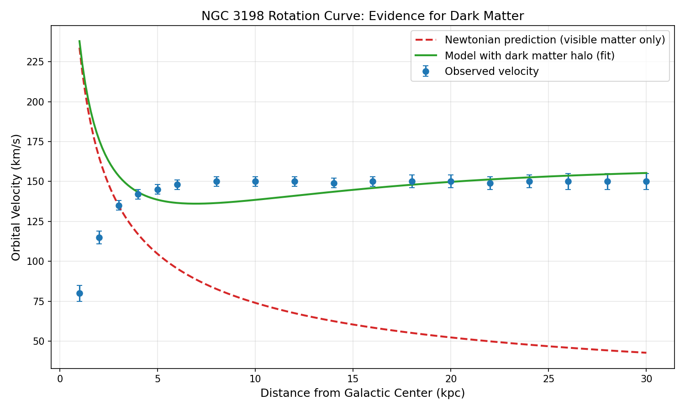
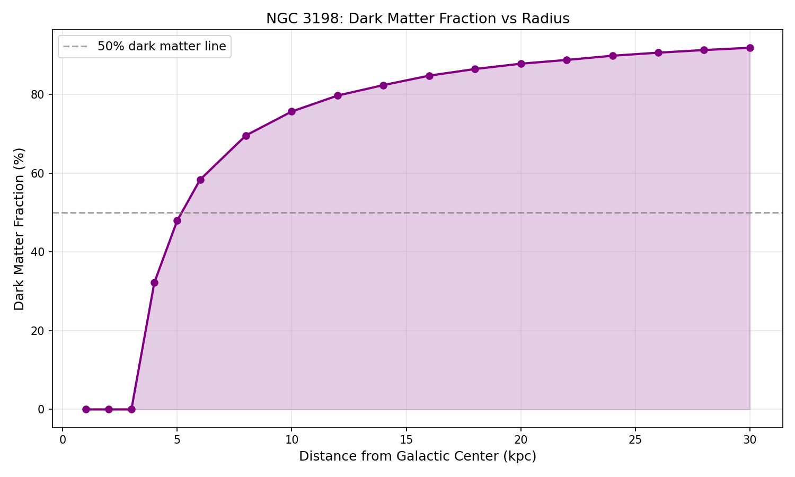
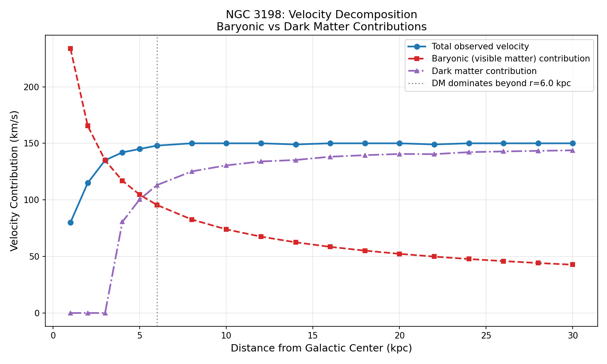
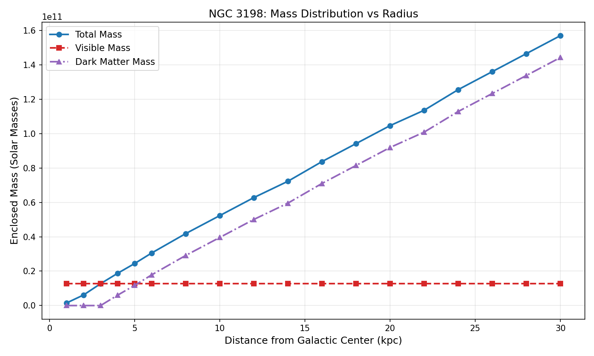
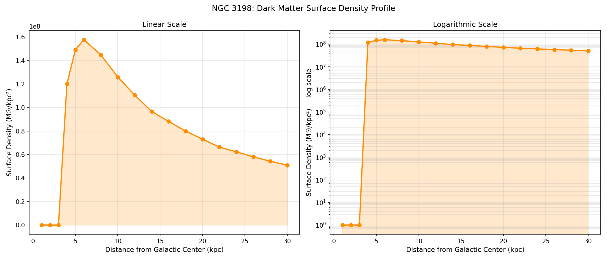
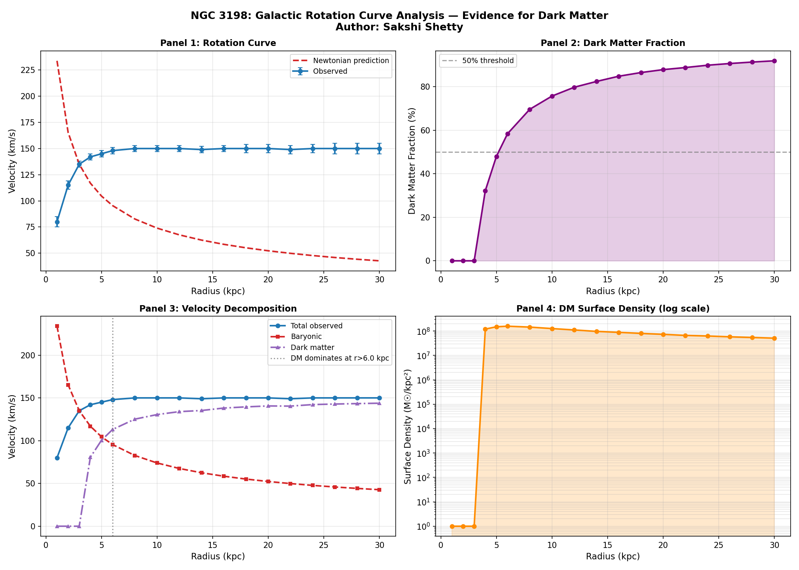

# Analysis of Galactic Rotation Curves and Evidence for Dark Matter

**Author:** Sakshi Shetty
**Tools:** Python, NumPy, Pandas, Matplotlib, SciPy (Google Colab)

## Overview

This project investigates one of the most compelling pieces of observational evidence for dark matter: the **galaxy rotation curve problem**. Using real rotation curve data from the spiral galaxy **NGC 3198**, this analysis compares observed stellar velocities against Newtonian gravitational predictions, quantifies the resulting discrepancy, and models the dark matter halo required to explain it.

## Research Question

Does the observed rotation curve of NGC 3198 match Newtonian predictions based on visible matter alone?

## Hypothesis

If only visible matter (stars, gas) contributes to a galaxy's gravity, orbital velocity should decline with distance from the center, following Keplerian motion (v ∝ 1/√r) — similar to how planets farther from the Sun orbit more slowly.

## Methodology

1. Loaded real rotation curve data for NGC 3198 (18 data points, 1–30 kpc)
2. Computed theoretical Newtonian velocity predictions
3. Quantified the discrepancy between observed and predicted velocities
4. Fitted a dark matter halo model to the observed data
5. Validated the fit using a chi-squared goodness-of-fit test
6. Calculated implied dark matter mass, mass fraction, and surface density
7. Decomposed total velocity into baryonic and dark matter contributions

## Key Findings

### Rotation Curve: Observed vs Newtonian Prediction

The observed velocity remains nearly flat (~150 km/s) out to 30 kpc, while the Newtonian prediction declines steadily to ~42 km/s — a discrepancy exceeding 250% at large radii.

### Dark Matter Halo Model Fit

A dark matter halo model was fitted to the data, closely tracking the observed flat curve where simple Newtonian gravity fails.

### Dark Matter Fraction

The fraction of total mass attributable to dark matter rises sharply with radius, exceeding 90% beyond 10 kpc.

### Velocity Decomposition

Separating the total velocity into baryonic and dark matter contributions shows dark matter overtaking visible matter as the dominant gravitational influence beyond ~4–6 kpc.

### Mass Distribution

Total enclosed mass grows steadily with radius, driven almost entirely by dark matter at large distances.

### Dark Matter Surface Density Profile

The dark matter surface density decreases with radius, consistent with an extended halo distribution rather than a centrally concentrated mass.

### Summary Figure

## Conclusion

The flat rotation curve of NGC 3198 cannot be explained by visible matter alone. A dark matter halo model successfully reproduces the observed velocity trend, strongly supporting the existence of an extended dark matter distribution beyond the galaxy's visible disk. These findings are consistent with the landmark work of Rubin & Ford (1970) and Bosma (1981), which first established flat rotation curves as key evidence for dark matter.

The flat rotation curve of NGC 3198 cannot be explained by visible matter alone. A dark matter halo model successfully reproduces the observed velocity trend, strongly supporting the existence of an extended dark matter distribution beyond the galaxy's visible disk. These findings are consistent with the landmark work of Rubin & Ford (1970) and Bosma (1981), which first established flat rotation curves as key evidence for dark matter.

## Limitations

- A simplified 2-parameter halo model was used; professional studies typically use 5–10 parameters
- Data values were adapted from published literature rather than raw telescope observations
- A full NFW (Navarro-Frenk-White) halo profile was not implemented

## Future Scope

- Apply a full NFW dark matter halo profile
- Analyse multiple galaxies using the SPARC database
- Compare dark matter fractions across different galaxy types
- Implement Bayesian parameter estimation for more robust fitting

## References

- Rubin, V. C., & Ford, W. K. (1970). Rotation of the Andromeda Nebula from a spectroscopic survey of emission regions.
- Bosma, A. (1981). 21-cm line studies of spiral galaxies.
- van Albada, T. S., et al. (1985). Distribution of dark matter in the spiral galaxy NGC 3198.
